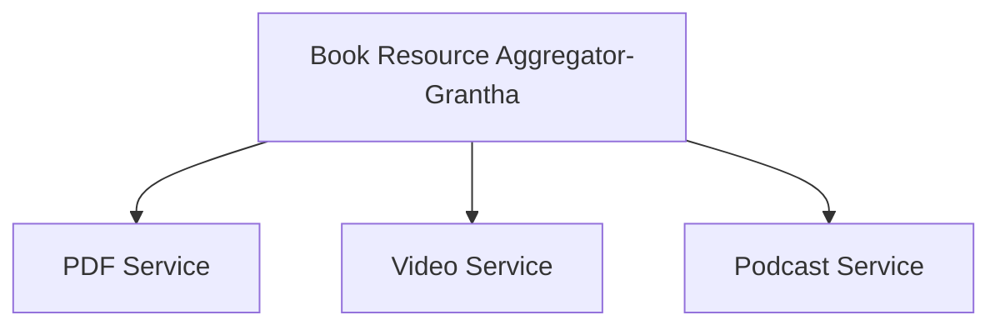

# Prerequisites and Installation Steps 

## Technologies & Tools Used

| Software             | Version Used       | Installation Link |
|----------------------|-------------------|------------------|
| **Spring Initializr** | Latest (2025)      | [🔗 Spring Initializr](https://start.spring.io/) |
| **IntelliJ IDEA**    | 2024.1 (Community/Ultimate) | [🔗 Download IntelliJ](https://www.jetbrains.com/idea/download/) |
| **VS Code**          | 1.87 (March 2025)  | [🔗 Download VS Code](https://code.visualstudio.com/) |
| **React.js**         | 18.2.0             | [🔗 React Docs](https://react.dev/) |
| **Node.js** (for React) | 18.19.0           | [🔗 Download Node.js](https://nodejs.org/) |
| **Postman**          | 11.0.0 (2025)      | [🔗 Download Postman](https://www.postman.com/downloads/) |
| **PostgreSQL**       | 15.6               | [🔗 Download PostgreSQL](https://www.postgresql.org/download/) |
